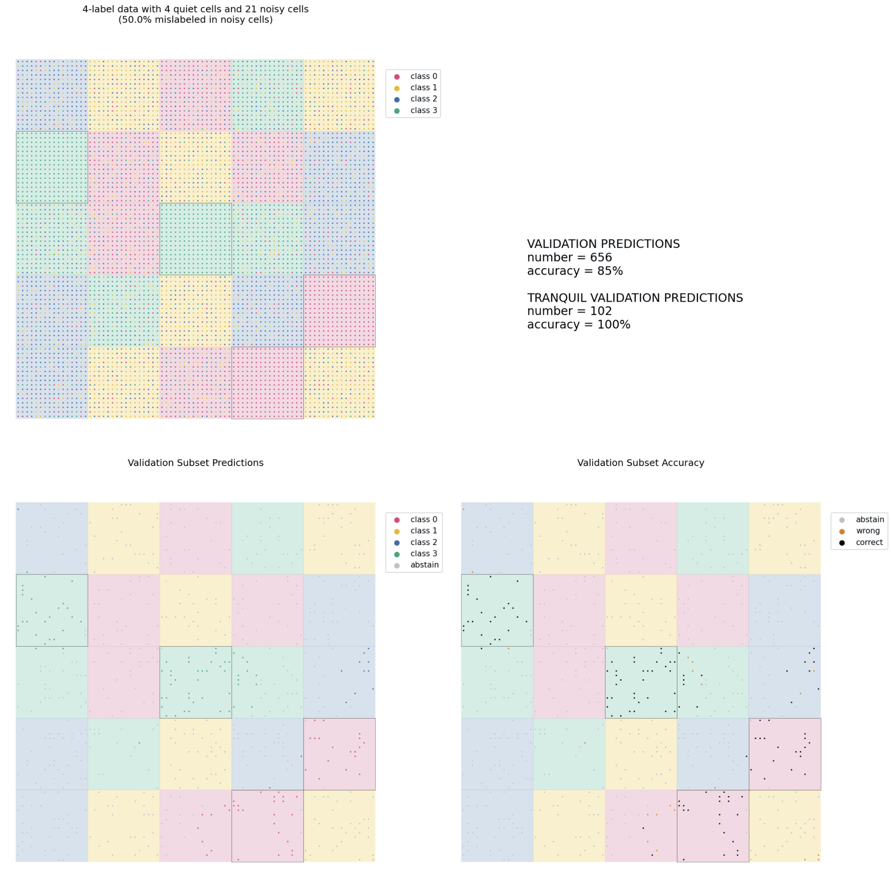
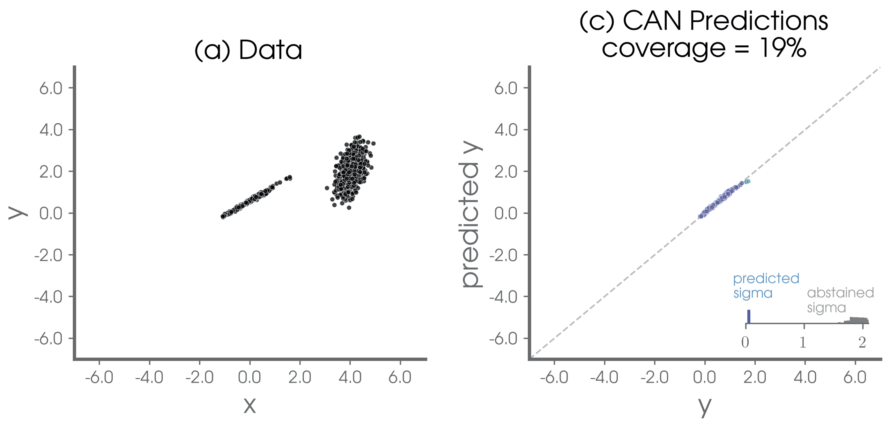

# Controlled Abstention Networks (CAN): classification & regression tasks
***
Deep neural networks for classification and regression tasks are trained with novel abstention losses such that that they can say "IDK" (I Don't Know) when they are not confident. Unlike many methods for attaching uncertainty to neural network predictions post-training, the abstention loss is applied during training to identify, and preferentially learn from, the more confident samples - leading to more accurate predictions.

* For classification tasks, we impose an additional _abstention class_ into which the network can place a sample when it is unsure of the answer. We also introduce the NotWrong loss which performs particularly well with the CAN.  Based on Thulasidasan (2020) but with substantial updates, this version uses a PID controller to fix the abstention rate to a user-defined value during training. Results are published in Barnes and Barnes (2021a).

* For regression tasks, the abstention loss works by incorporating uncertainty in the network's prediction based on a standard computer science method. The abstention loss is designed to determine the optimal abstention fraction, or abstain on a user-defined fraction via a PID controller. Results are published in Barnes and Barnes (2021b).


## Tensorflow Code
***
This code was written in python 3.7.9 with tensorflow 2.4. 

To implement the specific CAN code you will need the following:
* ```metrics.py```
* ```abstentionalloss.py```
* ```model.fit()``` will require the abstentionloss.AlphaUpdaterCallback()
* ```model.compile()``` will require custom metrics depending on the task, e.g.
    * ```metrics.AbstentionFraction(abstain)```
    * ```alpha_value(y_true,y_pred)```
    * where ```def alpha_value(y_true,y_pred): return loss_function.updater.alpha```

## Classification
***

Example classification use of the CAN is provided in ```classification/main_gameboard.ipynb``` using a synthetic "gameboard" data set for illustrative purposes.

<figure>
    
    <figcaption>Figure 1: Implementation on a synthetic "gameboard" data set for illustrative purposes. Original data is shown in the upper left while the bottom two panels show the validation results when the CAN abstention setpoint is set to 0.7 (i.e. abstains on 70% of the samples during training).</figcaption>
</figure>    

### Loss Function and PID Updater Options for Classification
General options for different loss functions and PID controller methods are briefly described below.

```
loss function classes
---------------------
* DACLoss(tf.keras.losses.Loss):
    Modified k-class cross-entropy per-sample loss with spinup, as defined by
    Sunil Thulasidasan.

* NotWrongLoss(tf.keras.losses.Loss):
    Abstention loss function that highlights being "not wrong", rather than
    being right, while penalizing abstentions.

alpha updater classes
---------------------
* Colorado(AlphaUpdater):
    Discrete-time PID updater using moving sums of batch counts.

* Minnesota(AlphaUpdater):
    Discrete-time PID updater using non-overlapping sets of batch counts.

* Washington(AlphaUpdater):
    A PID-like updater based on the code of Sunil Thulasidasan.

notes
-----
* All abstention loss functions have a penalty term to control the fraction of
abstentions. The penalty term takes the form:

    penalty = -alpha * log(likelihood of not abstaining)

* The updater determines how alpha changes throughout the training. The changes
can be systematic, or using control theory to achieve a specified setpoint.
```


## Regression
***

Example regression use of the CAN is provided in ```regression/main_1D.ipynb``` using a synthetic 1D data set for illustrative purposes.

<figure>
    
    <figcaption>Figure 2: Implementation on a synthetic 1D data set for illustrative purposes. Original data is shown in the left panel while the right panel shows the validation results when the CAN is allowed to determine the optimal abstention setpoint - leading to predictions on the most confident 19% of the testing data.</figcaption>
</figure>    

### Loss Function and PID Updater Options for Regression
General options for different loss functions and PID controller methods are briefly described below.

```
loss function classes
---------------------
* AbstentionLogLoss(tf.keras.losses.Loss):
    Abstention loss function that highlights being "not wrong", rather than
    being right, while penalizing abstentions.
    
* RegressLogLoss(tf.keras.losses.Loss):
    Abstention loss function that highlights being "not wrong", rather than
    being right, while penalizing abstentions.    

alpha updater classes
---------------------
* Colorado(AlphaUpdater):
    Discrete-time PID updater using moving sums of batch counts.

* Constant(AlphaUpdater):
    Keep alpha constant throughout training.

notes
-----
* The regression abstention loss function has a penalty term to control the fraction of
abstentions. The penalty term takes the form:

    penalty = -alpha * log(prediction weight)

* The updater determines how alpha changes throughout the training. The changes
can be systematic, or using control theory to achieve a specified setpoint.
```

## General Notes
***

### Tested With
* python 3.7.9
* tensorflow 2.4

### Credits
This work is a collaborative effort between [Dr. Elizabeth A. Barnes](https://sites.google.com/rams.colostate.edu/barnesresearchgroup/home) and [Dr. Randal J. Barnes](https://cse.umn.edu/cege/randal-j-barnes). With that said, work by Thulasidasan et al. (2019) and Thulasidasan (2020) were fundamental starting points for this work.

#### Funding sources
This work was funded, in part, by the NSF AI Institute for Research on Trustworthy AI in Weather, Climate, and Coastal Oceanography ([AI2ES](https://www.ai2es.org/)).

### References for the CAN
* Barnes, Elizabeth A. and Randal J. Barnes (2021a): Controlled abstention neural networks for identifying skillful predictions for classification problems, submitted to JAMES, 04/2021. 
* Barnes, Elizabeth A. and Randal J. Barnes (2021b): Controlled abstention neural networks for identifying skillful predictions for regression problems, submitted to JAMES, 04/2021. 

### Fundamental references for this work
* Thulasidasan, S., T. Bhattacharya, J. Bilmes, G. Chennupati, and J. Mohd-Yusof, 2019: Combating Label Noise in Deep Learning Using Abstention. https://arxiv.org/abs/1905.10964.
* Thulasidasan, S., 2020: Deep Learning with abstention: Algorithms for robust training and predictive uncertainty. https://digital.lib.washington.edu/researchworks/handle/1773/45781.

### License
This project is licensed under an MIT license.

MIT © [Elizabeth A. Barnes](https://github.com/eabarnes1010)

